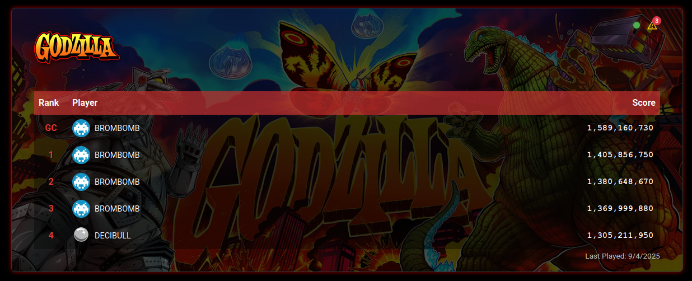
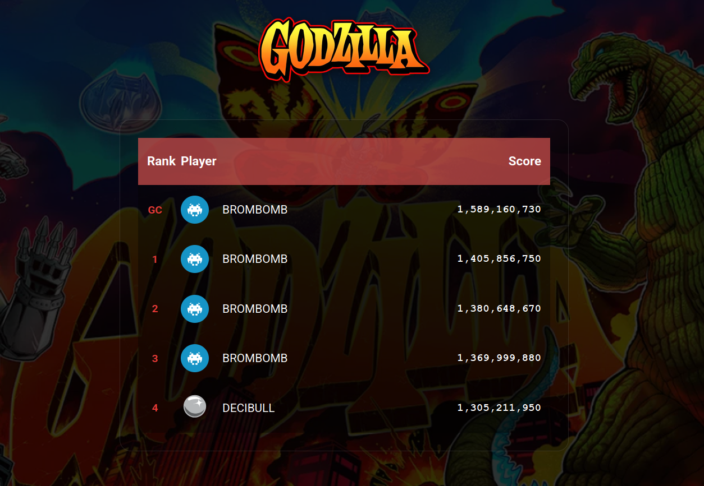

<p align="center">
  
</p>

# Stern Home Leaderboard

A beautiful web application for displaying pinball machine high scores from your Stern Pinball home network. Connect to Stern's API to showcase machine data, high scores, and player avatars in a clean, modern interface.

<p align="center">
  
</p>

## ✨ Features

- **🏆 Real-time High Scores** - Live display of current high scores for all your registered machines
- **📱 Responsive Design** - Works beautifully on desktop, tablet, and mobile devices
- **🖥️ Fullscreen Mode** - Perfect for kiosks and dedicated displays next to your machines
- **🎨 Customizable** - Full CSS theming support with custom assets and fonts
- **⚡ Auto-refresh** - Configurable periodic refresh keeps scores current
- **🔧 Easy Setup** - Simple Docker deployment with minimal configuration

<div align="center">
  <table>
    <tr>
      <td align="center">
        
        <br>
        <strong>Fullscreen Kiosk Mode</strong>
        <br>
        <em>Perfect for displays next to your machines</em>
      </td>
      <td align="center">
        
        <br>
        <strong>Machine Status Alerts</strong>
        <br>
        <em>Visual indicators for online/offline status</em>
      </td>
    </tr>
  </table>
</div>

## 🚀 Quick Start

Get up and running in under 5 minutes:

```bash
# 1. Clone the repository
git clone https://github.com/brombomb/stern-home-leaderboard.git
cd stern-home-leaderboard

# 2. Create your environment file
cp .env.example .env
# Edit .env with your Stern credentials

# 3. Start the application
docker-compose up --build

# 4. Open in your browser
open http://localhost:3000
```

**That's it!** Your leaderboard is now running and displaying your machine high scores.

## 📖 Documentation

| Guide | Description |
|-------|-------------|
| **[📋 Installation](docs/INSTALLATION.md)** | Complete setup guide with all configuration options |
| **[🎮 Features](docs/FEATURES.md)** | Fullscreen mode, kiosk setup, and advanced features |
| **[🎨 Customization](docs/CUSTOMIZATION.md)** | Themes, custom CSS, fonts, and visual modifications |
| **[🛠️ Development](docs/CONTRIBUTING.md)** | Local development, architecture, and contributing |
| **[🚨 Troubleshooting](docs/TROUBLESHOOTING.md)** | Common issues and solutions |


## ☕ Support This Project

If this helps showcase your pinball scores, consider supporting the development:

[](https://ko-fi.com/Y8Y01L3NIG)


- **🐛 Found a bug?** [Open an issue](https://github.com/brombomb/stern-home-leaderboard/issues)
- **💡 Have an idea?** [Start a discussion](https://github.com/brombomb/stern-home-leaderboard/discussions)
- **🛠️ Want to contribute?** See our [COONTRIBUTING Guide](docs/CONTRIBUTING.md)

## 📄 License

This project is for personal use with Stern Pinball machines. Please ensure compliance with [Stern's API terms of service](https://insider.sternpinball.com/).

---

<p align="center">
  <strong>⚡ Powered by Stern Pinball's API</strong><br>
  <a href="https://sternpinball.com/">Stern Pinball</a> •
  <a href="https://insider.sternpinball.com/">Stern Insider Portal</a>
</p>
